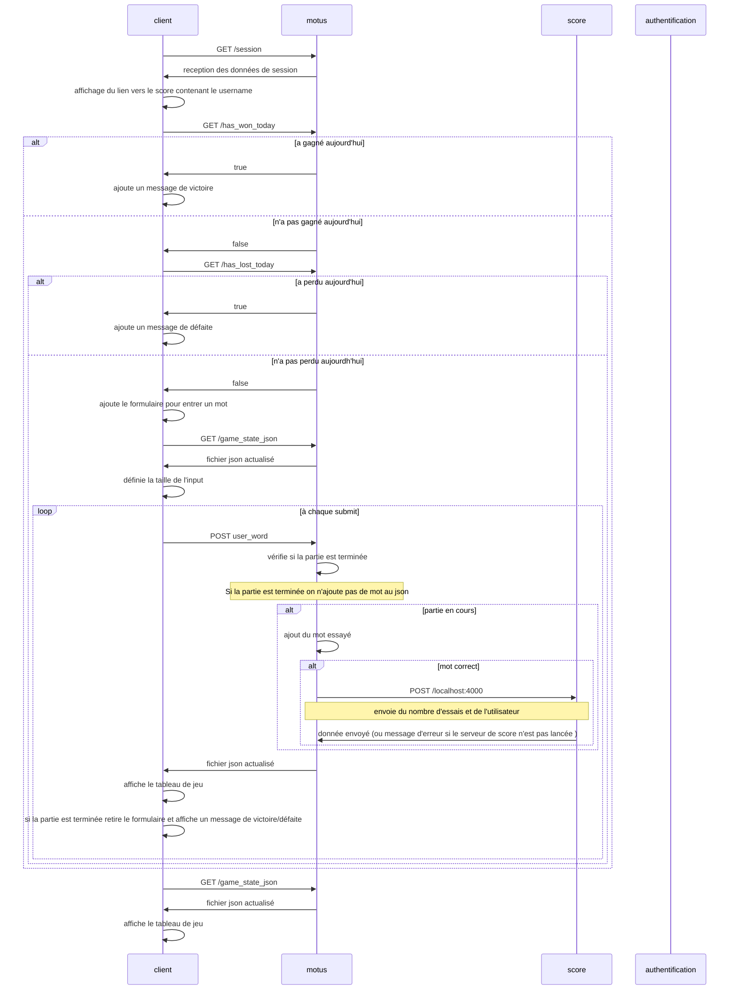

# Projet Microservices

## Que fait le projet

Ce projet permet de jouer au jeu du motus. Chaque jour, le joueur possède 6 essais pour deviner un mot selectionné aléatoirement. A chaque essais :
- une lettre bien placée sera sur fond vert
- une lettre mal placée mais présente dans le mot sera sur fond orange
- une lettre non présente dans le mot restera sur fond bleu

Si le joueur trouve le mot du jour, son score sera enregistré. Le joueur peut consulter le nombre de mots trouvés et le nombre d'essais moyen en cliquant sur le lien de la page de score.

## Etat du projet

Actuellement notre projet comprends :
- un microservice de **motus**
- un microservice de **score**
- un service **d'authentification**

Ces microservices sont indépendants et fonctionnels.
Nous avons pu implémenter les fonctionnalités demandés dans l'ensemble des TP dont l'authentification oAuth2. Ainsi lorsque l'utilisateur lance la page de motus, il est redirigé vers le service d'authentification s'il n'est pas connecté et on lui propose de se créer un compte et de se connecter.

De plus, nous avons utilisé une image docker de postgres pour créer une base de donnée contenant les pseudos et mot de passe des utilisateur. Pour gérer la connexion des utilisateurs nous utilisons le middlewere **Passport** comme conseillé dans le bonus du TD auth.

Pour chacun des microservices, nous avons créé un Dockerfile et nous utilisons un docker-compose.yml pour lancer le projet.


Nous avons aussi travaillé sur la partie monitoring mais nous n'avons pas eu le temps de l'intégrer à notre solution.

## Lancer le projet avec Docker && Docker-compose

Ouvrez le terminal où et positionnez vous dans le dossier principal du projet contenant docker-compose.yml.
Créez les conteneurs requis de manière uniforme via docker-compose.yml et démarrez tous les services avec les commandes :

```sh
sudo docker-compose build 

sudo docker-compose up
```

## Database
Normalement, la base de données devrait être générée automatiquement grâce au volume   - ./init.sql:/docker-entrypoint-initdb.d/init.sql dans notre **docker-compose.yml** et à un fichier **init.sql** contenant les instructions de création de la base de données.

Cependant, si vous possédez déjà des bases de données sur postgres, notre base de données pourrais ne pas être générée.
Dans ce cas : exécutez le conteneur postgres_data1 via docker et entrez dans la base de données via le compte et le mot de passe de la base de donné. Instructions ci-dessous :

```sh
sudo docker exec -it postgres_data1  /bin/bash

POSTGRES_PASSWORD=$POSTGRES_PASSWORD psql -U$POSTGRES_USER -d$POSTGRES_DB
```

Initialisation de la table des utilisateurs de la base de données.(Définir l'ID d'incrémention automatique)

```sh
CREATE TABLE USERS(

ID SERIAL PRIMARY KEY , 

USERNAME VARCHAR(20) NOT NULL ,

PASSWORD VARCHAR(20) NOT NULL

);
```

Maintenant il suffit de se rendre sur les pages :
http://localhost:3000 pour accéder au motus
http://localhost:4000 pour accéder au score
http://localhost:8080 pour accéder l'authentification

## Architecture du projet

Comme précisé plus haut, notre projet comprends :
- un microservice de **motus** utilisant le port 3000
- un microservice de **score** utilisant le port 4000
- un service **d'authentification** utilisant le port 8080

Dans cette partie nous expliquons avec un diagramme de sequence simplifié les interactions principales entre les différents services. Dans les prochaines parties, les diagrammes de séquences seront plus détaillés pour le microservice concerné.


Lorsque l'on arrive sur la page de motus, si l'on n'est pas connecté,  on est diretement redirigé sur la page de login.
Quand on se connecte sur la page de login, on va suivre une suite de redirections entre le serveur de motus et d'authentification. Ces instructions ont pour but de se connecter sur la session de motus en ajoutant le username situé dans la base de données du serveur d'authentification dans la session du serveur de motus. Cela ce fait en 6 étapes : 
- Etape 1: Après avoir vérifié que session.user n'est définie dans le motus, on nous redirige vers **http://localhost:8080/authorize** sur le serveur d'authentification avec des paramètres.
- Etape 2 : Les paramètres envoyés sont controlés et on est redirigé vers la page de login.
- Etape 3: Si l'utilisateur se connecte, le serveur d'authentification créer un code aléatoire et enregistre le login de l'utilisateur.
- Etape 4: Le serveur d'authentification envoie le code au motus sur /http://localhost:3000/callback. Quand le serveur de motus reçoit le code, il appelle l'API /token sur le serveur d'authentification.
- Etape 5: Dans l'API /token de auth, le code est vérifié et un token contenant le login de l'utilisateur est créé avec jsonwebtoken, puis envoyé au motus sur /get_token.
Step6: Le motus récupère le username contenu dans le token et l'enregistre dans la session ce qui permet d'accéder au motus en étant connecté.

### Communications
Les microservices de motus et d'authentification communiquent entre eux notamment en s'échangeant un code et un token dans le but récupérer le nom d'utilisateur dans la session du motus.
Le microservice de motus communique avec le score pour envoyer le nom du joueur et le résultats des joueurs.
Il n'y a pas de communication entre le microservice de score et le microservice d'authentification.

### Stockage des données

Les scores des différents utilisateurs est stocké dans un fichier json **score.json** sur le serveur de score.
Les essais des différents utilisateurs sur le jeu du motus sont stockées dans une variable json **game_state_json** sur le serveur de motus.
Les utilisateurs et leurs mots de passe sont stockées dans la base de données postgres dans docker.

## Motus

Le microservice de motus possède :
- le serveur **index.js** qui gère les requêtes GET et POST sur le port **3000**
- le dossier **data** contenant les listes de mots à deviner
- le dossier statique **public** contenant:
  - la page de jeu **index.html**
  - la css de la page du jeu  **CSS.css**
  - la page JavaScript du jeu **script.js**
- un **Dockerfile**

Toutes les vérifications et modification de l'état du jeu se font du côté serveur. Le **script.js** côté client s'occupe uniquement de demander l'état du jeu et de mettre à jour l'affichage de la page. Ainsi, le joueur n'a pas moyen de tricher en récupérant le mot du jour. Nous avons personnalisé la présentation de notre motus avec le css et le script.js. Ci-dessous les détails des actions du serveur et du client.

Le serveur de motus possède les API suivantes :
- **/callback** pour obtenir le code générer par le serveur d'authentification et le renvoyer
- **/get_token** pour récupérer le username dans le token et le stocker la variable de session
- **/session** pour afficher le contenu de la session
- **/logout** pour détruire la session
- **/word** pour afficher le mot du jour
- **/port** pour afficher le port d'écoute du serveur
- **/game_state_json** pour envoyer l'état du jeu JSON au client
- **/has_won_today** pour envoyer un booléen indiquant si le joueur a déjà gagné au client
- **/has_lost_today** pour envoyer un booléen indiquant si le joueur a déjà perdu au client
- **/** pour vérifier si la partie est toujours en cours et si c'est le cas ajouter l'entrée de l'utilisateur à la liste de mot essayé et vérifier s'il est correcte 

Quand le serveur est lancée, le mot du jour est selectionné. On initialise aussi une variable JSON nommé **game_state_json** contenant:
```json
{
  "example": {
    "word_size": get_todayWord().length,
    "first_letter": get_todayWord()[0],
    "words_tried": [],
    "last_correct_word_found": ""
  }
}
```
Ici, c'est juste un exemple représentant 1 utilisateur, mais en temps normal "example" est remplacé par le nom de l'utilisateur. Quand des nouveaux utilisateurs se connextent au motus, ils auront leur données ajoutés dans ce json. La variable **game_state_json** sera mise à jour sur le serveur uniquement et renvoyé au client lors des requêtes.
**word_tried** contient les mots entrées par l'utilisateur et une valeur associée à chaque lettre pour savoir de quelle couleur la page html doit afficher la lettre. Ci-dessous un exemple:
```json
{
  "word_tried": [
    {
      "letters": [
        {"w":0},
        {"o":1},
        {"r":2},
        {"d":0}
      ]
    }
  ]
}
```


Quand le client charge la page **index.html**, après que sont pseudo soit ajouté dans la session, celle-ci effectue une requête GET **/session** pour récupérer pseudo de la session et l'ajouter à l'url menant à la page de score. Cela permet de consulter les données de l'utilisateur correspondant en cliquant sur le lien de la page de score.

Ensuite, 2 requêtes GET sont effectués pour savoir si l'utilisateur a déjà gagné ou perdu aujourd'hui.
- Si c'est le cas, un message de victoire ou de défaite est affiché.
- Sinon un fomulaire est ajouté à la page html pour entrer un mot.
  - un GET est effectué pour récupérer la taille du mot du jour et limiter la taille de l'input utilisateur à cette valeur
  - A chaque entrée de l'utilisateur:
    -  on vérifie que les caractères sont alphanumériques
    - le mot est envoyé via un POST au serveur
    - le serveur vérifie si la partie est terminée.
    Si la partie est toujours en cours, le serveur ajoute un mot dans **words_tried** et vérifie si le mot est correcte.
    Si le mot est correcte le serveur entre le mot dans **last_correct_word_found** et envoie le nombre d'essais au serveur de score via un POST
    - le client effectue un GET pour obtenir **game_state_json** et afficher le tableau de jeu actualisé
    - le client vérifie lui aussi si le jeu est terminé pour retirer le formulaire et afficher un message de victoire/défaite.
- un GET est effectué pour obtenir **game_state_json** et afficher le tableau de jeu 

Voici un diagramme de séquence du motus sans prendre en compte la partie oAuth2/Openid.


## Score

Le microservice de score possède :
- le serveur **index.js** qui gère les requêtes GET et POST sur le port **4000**
- le fichier JSOn **score.json** contenant le nombre de mots trouvés par l'utilisateur et le nombre d'essais total
- le dossier statique **public** contenant:
  - la page de score **index.html**
  - la css de la page du score  **CSS_score.css**
  - la page JavaScript du score **score_script.js**
- un **Dockerfile**

Le serveur de score possède les API suivantes : 
- **/** pour récupérer le nombre d'essais envoyé par le serveur de motus et l'ajouter au total d'essais dans le fichier **score.json**
- **/port** pour afficher le port d'écoute du serveur
- **/score_json** pour envoyer le fichier JSON de score au client

Quand le client charge la page **index.html** celle-ci effectue une requête **GET /score_json** pour récupérer le fichier **socre.json** et affiche le nombre de mots trouvés et le nombre moyen d'essais de l'utilisateur (en divisant le nombre total d'essais par le nombre de mots trouvés).

Quand un joueur trouve le bon mot sur le microservice de motus, le serveur du motus envoie une requête POST au serveur de score qui récupère le nombre d'essais avec l'API **/** et ajoute ce nombre au total d'essais dans le fichier **score.json**.

Voici le diagramme de séquence du score.


Le score est aussi mis à jour la première fois qu'un utilisateur se connecte sur le motus pour initialiser son score à 0.
La procédure est la même que celle vu plus haut avec un nombre d'essais nul.

## Authentification
Les fichiers importants du microservice d'authentification sont :
- un **Dockerfile**
- le fichier **api.js** dans lequel sont situés nos API et la génération de code et de token.

Le serveur d'authentification possède les API suivantes :
- **/authorize** pour controler les paramètres clientid, scope et redirect_uri envoyés et retourner la page de login
- **/token** pour créer le token contenant le username si le code reçu du motus est bon.


## Prochaines étapes

Les prochaines étapes du projet sont :
- Intégrer notre travaille sur le TD monitoring à notre solution
- Créer un proxy
